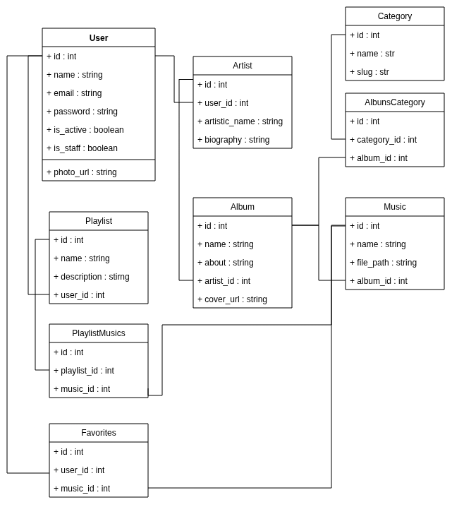

# DuckMusic

## Sumary
- [Requeriments](#requiriments)
- [Runing / install](#runing)
- [Project Structure](#project-structure)
- [contributors](#contributors)
- [changes historic](#changes-historic)
- [lincense](#lincense)
- [how to contribe](#how-to-contribe)

## Requiriments
- python (3.11)
- postgressql , mysql or another relational database
- git and github
- uv

## Runing

1- clone repository
``` bash
# clone repository
git clone https://github.com/PedroLopes30/DuckMusic/
# or
git clone https://github.com/Jose-GuilhermeG/DuckMusic/ 

cd duckMusic
```

2- install dependicies
```bash
    cd ./src/api/
    uv venv
    uv sync
```

3.set dot env variables
```bash
    cp .env-example .env
```

4 - Runing
```bash
    #with fastapi dev
    uv run fastapi dev main.py
    #or with uvicorn
    PYTHONPATH=../../src/ uv run uvicorn --port 8000 main:app --reload
 
``` 

## Project Structure
```
└── 📁duckMusic
    └── 📁docs # arquivos de documentação
        ├── CHANGELOG.md
        ├── routes.md
    └── 📁src # projeto
        └── 📁api 
            └── 📁admin # admin do projeto (gerenciamento dos dados)
                ├── autenticate.py # logica de acesso ao admin
                ├── auth_admin.py
            └── 📁configs
                ├── __init__.py
                ├── celery.py
                ├── db.py
                ├── redis.py
                ├── settings.py #configurações gerais
            └── 📁core # logica reutilizavel
                ├── __init__.py
                ├── constants.py
                ├── files.py
                ├── models.py
                ├── utils.py
            └── 📁depends # dependencias injetadas nas views do fastapi
                ├── __init__.py
                ├── auth_dep.py
                ├── data_dep.py
            └── 📁interfaces
                ├── __init__.py
                ├── access_service.py
                ├── hash.py
                ├── repository.py
                ├── token_service.py
            └── 📁middlewares
                ├── __init__.py
                ├── database_middleware.py
            └── 📁migrations
                └── 📁versions
                    ├── 07802f1139b3_add_user_photo_url.py
                    ├── b6114cad90d4_first_migration.py
                ├── env.py
                ├── README
                ├── script.py.mako
            └── 📁models
                ├── __init__.py
                ├── auth.py
            └── 📁routes # endpoints
                ├── __init__.py
                ├── auth.py
            └── 📁shemas
                └── 📁input
                    ├── __init__.py
                    ├── auth_input.py
                └── 📁output
                    ├── __init__.py
                    ├── auth_output.py
                    ├── general_output.py
            ├── __init__.py
            ├── .python-version
            ├── alembic.ini
            ├── main.py # arquivo principal
            ├── pyproject.toml
            ├── repository.py
            ├── tasks.py
            ├── uv.lock
    ├── .editorconfig
    ├── .env-example
    ├── .gitignore
    ├── CONTRIBUTING.md
    ├── license
    └── README.md
```

## Models


## Contributors

- [José Guilherme](https://github.com/Jose-GuilhermeG)
- [Pedro lopes](https://github.com/PedroLopes30)

## changes historic
- [changelog](./docs/CHANGELOG.md)

## lincense
- [lincense](./license)

## How to contribe
- [contribe](./CONTRIBUTING.md)